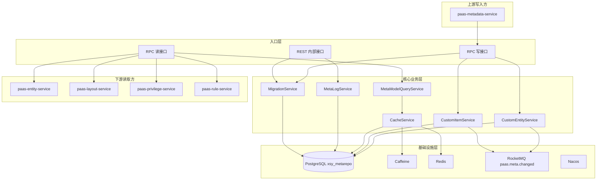
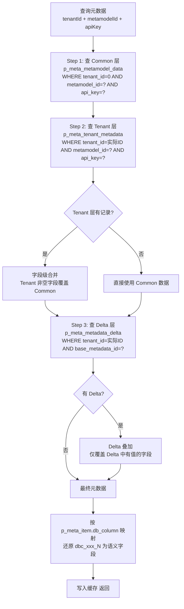
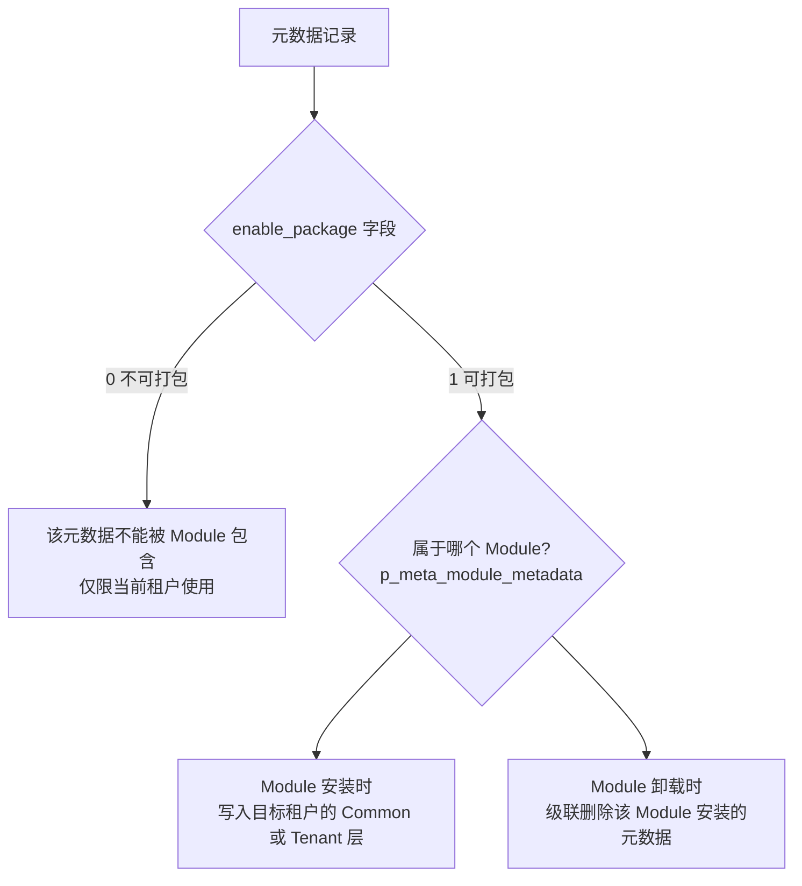
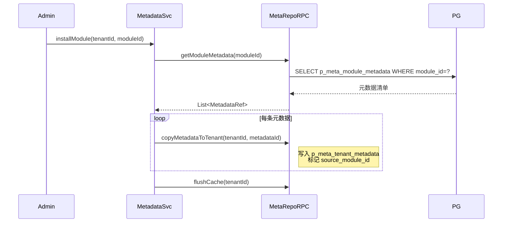
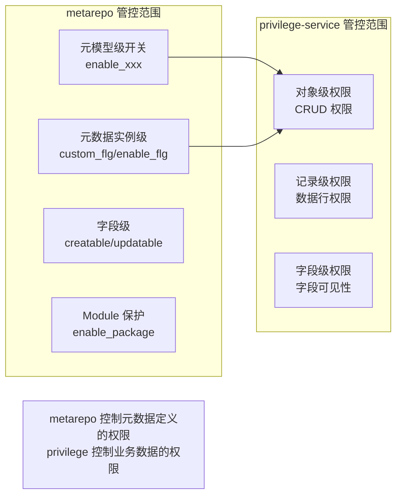
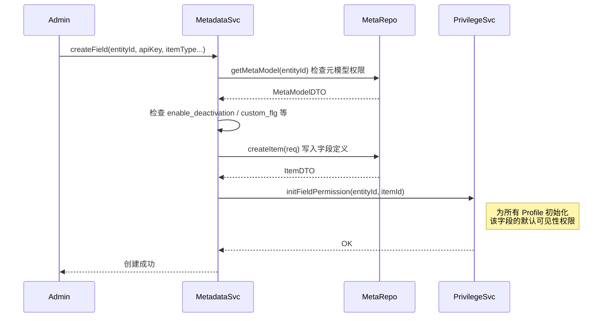
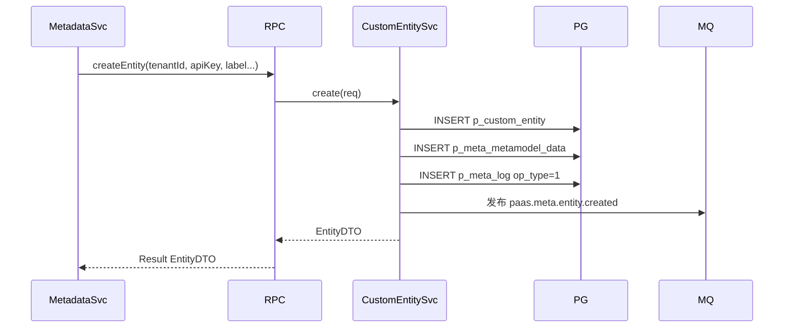
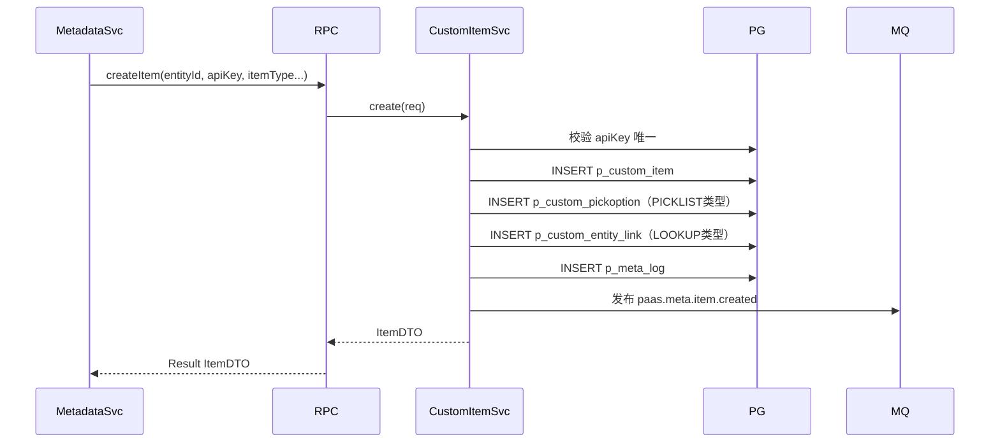
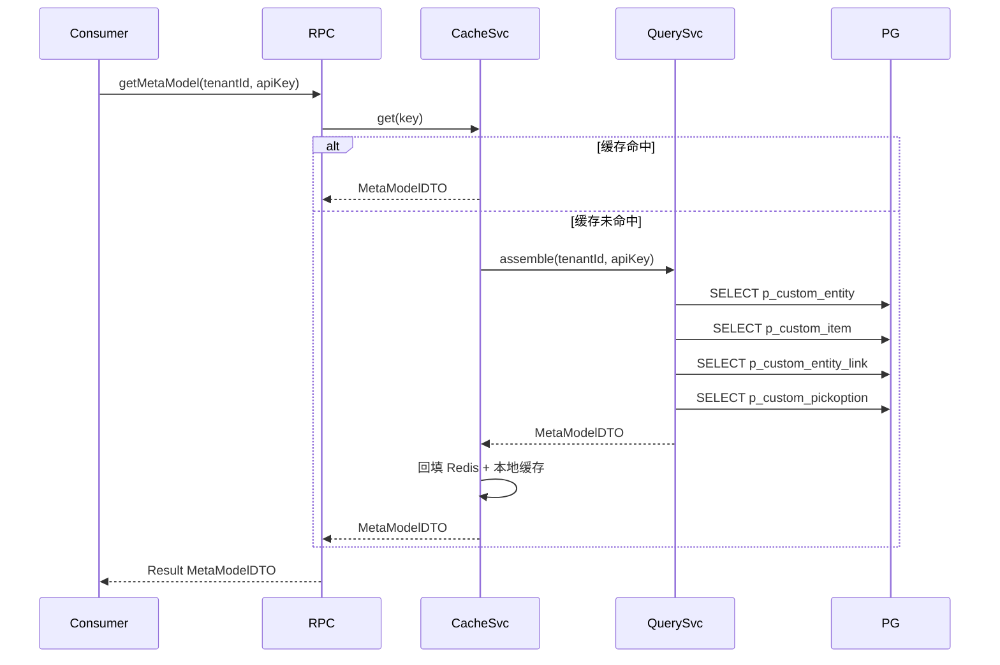

# paas-metarepo-service 技术设计方案

## 1. 服务概述

元数据仓库服务，是 aPaaS 平台的**元数据主动存储中枢**。`paas-metadata-service` 的所有元数据写操作直接通过本服务的 RPC 接口持久化到 PostgreSQL（schema: `xsy_metarepo`），本服务同时为 entity、layout、privilege、rule 等下游服务提供高性能的元数据读取能力。

**核心定位：**
- 不是被动的"快照接收方"，而是元数据的**唯一持久化层**
- metadata-service 是业务逻辑层，metarepo-service 是存储层，两者是调用关系而非推送关系
- 底层采用**通用大宽表（p_meta_metamodel_data）+ metamodel_id 分类**的架构，新增元数据类型无需 DDL 变更

**服务层级：L1（与 metadata-service 同层，平台基础层）**

---

## 2. 系统架构



---

## 3. 核心架构：通用大宽表机制

### 3.1 三层元数据架构

```
第一层：p_meta_model（元模型 Schema 定义）
    定义"有哪些类型的元数据"，如：对象、字段、布局、规则等
    平台级配置，不随租户变化

第二层：p_meta_item（元模型字段项定义）
    定义每种元模型有哪些属性字段
    p_meta_item.db_column 映射到大宽表的 dbc_xxx_N 列

第三层：p_meta_metamodel_data（通用大宽表，元数据实例）
    所有类型的元数据实例都存在这一张表
    通过 metamodel_id 区分类型，dbc_xxx_N 列的语义由第二层决定
    租户级覆盖：p_meta_tenant_metadata（结构相同，租户数据优先）
    增量定制：p_meta_metadata_delta（delta 叠加，不修改基础数据）
```

### 3.2 业务层快捷表

`p_custom_entity` / `p_custom_item` 是在大宽表之上的**业务层快捷视图**，字段语义明确，供 metadata-service 直接操作。

- `p_custom_entity.object_id` 对应 `p_meta_metamodel_data.id`
- `p_custom_item.entity_id` 对应 `p_custom_entity.id`
- 写入时两张表同步维护，查询时优先走快捷表

### 3.3 Common 级与 Tenant 级存储结构

元数据分为两个层级，物理上存在不同的表中：

| 层级 | 存储表 | tenant_id | 说明 |
|---|---|---|---|
| Common（平台级） | `p_meta_metamodel_data` | 0 | 平台预置的标准元数据，所有租户共享，不可被租户直接修改 |
| Tenant（租户级） | `p_meta_tenant_metadata` | 实际租户ID | 租户自定义或覆盖的元数据，优先级高于 Common |

**Common 级元数据的来源：**
- 平台初始化时预置（标准对象如 Account、Contact、Opportunity）
- ISV 通过 Module/Package 安装的扩展元数据
- 平台升级时新增的标准功能元数据

**Tenant 级元数据的来源：**
- 租户管理员创建的自定义对象和字段
- 租户对 Common 元数据的属性覆盖（如修改标签、隐藏字段、调整排序）
- 租户安装 Module 后的个性化配置

**两者的物理结构完全相同**（都是大宽表 `dbc_xxx_N` 列），区别仅在于 `tenant_id` 的值和查询时的合并优先级。

### 3.4 Common/Tenant 合并逻辑（核心算法）



**合并规则详解：**

```
最终值 = Delta(Tenant(Common))

对于每个 dbc_xxx_N 列：
  1. 取 Common 层的值作为基础
  2. 如果 Tenant 层该列非 NULL，用 Tenant 值覆盖
  3. 如果 Delta 层该列非 NULL，用 Delta 值覆盖
  4. 最终值即为该字段的有效值
```

**合并示例（对象元数据，metamodel_id=1）：**

| 字段（db_column 映射） | Common 值 | Tenant 值 | Delta 值 | 最终值 |
|---|---|---|---|---|
| label（dbc_varchar_1） | "客户" | "我的客户" | NULL | "我的客户" |
| enable_sharing（dbc_tinyint_1） | 1 | NULL | 0 | 0 |
| searchable（dbc_tinyint_2） | 1 | NULL | NULL | 1 |
| description（dbc_textarea_1） | "标准客户对象" | NULL | "定制描述" | "定制描述" |

**子元数据的合并（字段列表）：**

对象下的字段列表合并更复杂，需要处理"新增"和"隐藏"：

```
1. 查 Common 层该对象下所有字段（parent_object_id = 对象ID）
2. 查 Tenant 层该对象下所有字段
3. 合并规则：
   - Common 有、Tenant 无 → 使用 Common 字段（标准字段）
   - Common 有、Tenant 有（同 api_key）→ Tenant 覆盖 Common（属性定制）
   - Common 无、Tenant 有 → 纯租户自定义字段
   - Tenant 中 delete_flg=1 → 该字段对此租户隐藏（不删除 Common）
4. 按 metadata_order 排序
```

### 3.5 Delta 机制详解

Delta 是比 Tenant 更细粒度的覆盖层，用于以下场景：

| 场景 | 说明 |
|---|---|
| 沙箱环境 | 沙箱中的修改存为 Delta，不影响生产环境的 Tenant 数据 |
| A/B 测试 | 对部分用户启用不同的元数据配置 |
| 版本灰度 | 新版本元数据先以 Delta 形式存在，验证后合并到 Tenant |
| Module 覆盖 | Module 安装时对已有元数据的增量修改 |

Delta 的生效由 `p_meta_model.enable_delta` 控制，只有启用了 delta 的元模型类型才会查询 Delta 层。`delta_scope` 和 `delta_mode` 控制 Delta 的作用范围和合并模式。

---

## 3A. Module 控制机制

### 3A.1 Module 概念

Module（模块/包）是元数据的分发和管理单元，类似 Salesforce 的 Managed Package。一个 Module 包含一组相关的元数据（对象、字段、布局、规则等），可以被安装到不同租户。

**相关表：**
- `p_meta_module`：模块定义
- `p_meta_module_metadata`：模块包含的元数据清单

### 3A.2 Module 对元数据的控制



**Module 安装流程：**



**Module 控制字段（分布在多张表中）：**

| 表 | 字段 | 说明 |
|---|---|---|
| `p_meta_model` | `enable_package` | 该元模型类型是否支持打包 |
| `p_meta_model` | `enable_module_control` | 是否启用模块级权限控制 |
| `p_meta_item` | `enable_package` | 该字段项是否可被 Module 包含 |
| `p_meta_metamodel_data` | `owner_id` | 元数据所属 Module ID（NULL=无归属） |
| `p_custom_entity` | `enable_package` | 对象是否可打包 |
| `p_custom_item` | `enable_package` | 字段是否可打包 |

**Module 对元数据的保护：**
- Module 安装的元数据，租户只能覆盖部分属性（label、description、enable_flg），不能修改核心结构（data_type、type_property）
- Module 卸载时，级联删除该 Module 安装的所有 Tenant 层元数据
- Module 升级时，通过 Delta 机制增量更新，不破坏租户的自定义覆盖

---

## 3B. 元数据权限控制

### 3B.1 权限控制层次

元数据的权限控制分为三个层次：

```
Layer 1: 元模型级权限（哪些类型的元数据可以被操作）
    → p_meta_model 的 enable_xxx 字段控制

Layer 2: 元数据实例级权限（具体某条元数据谁可以读写）
    → 通过 tenant_id + custom_flg + enable_flg 控制

Layer 3: 字段级权限（元数据中的哪些属性可以被修改）
    → p_meta_item 的 creatable / updatable 控制
```

### 3B.2 Layer 1：元模型级权限

`p_meta_model` 上的开关字段决定了该类型元数据的全局能力：

| 字段 | 说明 | 影响 |
|---|---|---|
| `enable_package` | 是否支持打包 | 控制该类型元数据能否被 Module 包含和分发 |
| `enable_app` | 是否支持应用 | 控制该类型元数据能否关联到应用 |
| `enable_deprecation` | 是否支持废弃 | 控制该类型元数据能否被标记为废弃 |
| `enable_deactivation` | 是否支持停用 | 控制该类型元数据能否被停用（enable_flg=0） |
| `enable_delta` | 是否支持增量 | 控制该类型元数据是否走 Delta 合并逻辑 |
| `enable_log` | 是否记录变更日志 | 控制写操作是否写 p_meta_log |
| `enable_module_control` | 是否启用模块控制 | 控制该类型元数据是否受 Module 保护 |

### 3B.3 Layer 2：元数据实例级权限

每条元数据实例上的标记字段控制其可见性和可操作性：

| 字段 | 表 | 说明 |
|---|---|---|
| `custom_flg` | 大宽表 / p_custom_entity / p_custom_item | 0=标准（平台预置，不可删除），1=自定义（租户创建，可删除） |
| `enable_flg` | p_custom_entity / p_custom_item | 0=停用，1=启用。停用的元数据对下游服务不可见 |
| `hidden_flg` | p_custom_entity / p_custom_item | 0=可见，1=隐藏。隐藏的元数据在 UI 不展示但 API 可访问 |
| `delete_flg` | 所有表 | 0=正常，1=已删除。软删除标记 |
| `visible` | p_meta_model | 0=内部，1=对外可见。控制元模型类型是否对租户管理员可见 |

**权限判断伪代码：**

```java
boolean canModify(MetadataRecord record, OperationType op) {
    // 标准元数据不可删除
    if (op == DELETE && record.customFlg == 0) return false;
    
    // 停用的元数据不可更新（除了重新启用）
    if (op == UPDATE && record.enableFlg == 0 && !isReactivation) return false;
    
    // Module 保护的元数据，只能修改允许的字段
    if (record.sourceModuleId != null && isProtectedField(field)) return false;
    
    // 检查 p_meta_item 的 creatable/updatable
    if (op == CREATE && !metaItem.creatable) return false;
    if (op == UPDATE && !metaItem.updatable) return false;
    
    return true;
}
```

### 3B.4 Layer 3：字段级权限

`p_meta_item` 上的 `creatable` 和 `updatable` 控制元数据实例中每个属性字段的读写权限：

| creatable | updatable | 含义 |
|---|---|---|
| 1 | 1 | 创建时可填，创建后可改 |
| 1 | 0 | 创建时可填，创建后只读（如 api_key） |
| 0 | 1 | 创建时不可填（系统自动生成），创建后可改 |
| 0 | 0 | 完全只读（如 id、created_at） |

### 3B.5 与 privilege-service 的协作

metarepo 负责**元数据自身的结构性权限**（谁能创建/修改/删除元数据定义），privilege-service 负责**业务数据的访问权限**（谁能读写某条业务记录）。两者的关系：



**协作流程示例（租户管理员创建自定义字段）：**



### 3B.6 元数据权限的缓存 Key 设计

由于权限判断在每次元数据读取时都会发生，需要高效的缓存：

| 缓存 Key | 内容 | TTL |
|---|---|---|
| `meta:model:{metamodelId}:caps` | 元模型级能力开关 JSON | 60min |
| `meta:acl:{tenantId}:{entityId}` | 对象级权限标记（custom_flg/enable_flg/hidden_flg） | 30min |
| `meta:item:acl:{tenantId}:{entityId}` | 字段级权限列表（creatable/updatable/visible_status） | 30min |
| `meta:module:{tenantId}:{moduleId}` | Module 安装状态和保护字段列表 | 30min |

---

## 4. 模块职责

### 4.1 CustomEntityService（自定义对象 CRUD）

直接操作 `p_custom_entity` 和对应的 `p_meta_metamodel_data` 实例。

| 方法 | 说明 |
|---|---|
| `createEntity` | 创建自定义对象，同步写 p_custom_entity + p_meta_metamodel_data |
| `updateEntity` | 更新对象属性，写 p_meta_log 记录变更 |
| `deleteEntity` | 软删除 delete_flg=1，级联处理字段和关系 |
| `getEntity` | 按 tenantId + apiKey 查询（走缓存） |
| `listEntities` | 查询租户下所有对象 |

### 4.2 CustomItemService（自定义字段 CRUD）

操作 `p_custom_item`，字段类型扩展属性存入 `type_property`（JSON）。

| 方法 | 说明 |
|---|---|
| `createItem` | 创建字段，校验 apiKey 唯一性 |
| `updateItem` | 更新字段，兼容性校验 |
| `deleteItem` | 软删除，检查布局/规则引用 |
| `listItems` | 查询对象下所有字段 |
| `getPickOptions` | 查询字段选项值 |

### 4.3 MetaModelQueryService（元模型组装与查询）

核心读取服务，将多张表组装为完整的 `MetaModelDTO`。

| 方法 | 说明 |
|---|---|
| `getMetaModel` | 组装完整元模型（对象+字段+关系+选项值） |
| `batchGetMetaModel` | 批量组装，减少 RPC 次数 |
| `listMetaModels` | 租户下所有对象的元模型列表 |
| `getFieldMeta` | 仅查询字段元数据 |

### 4.4 CacheService（多级缓存）

| 层级 | 实现 | TTL | 容量 |
|---|---|---|---|
| L1 本地缓存 | Caffeine | 5min | 10000 条 |
| L2 分布式缓存 | Redis | 30min | 无限制 |

缓存失效：写操作完成后发布 MQ 事件 `paas.meta.changed`，所有实例通过 Redis Pub/Sub 广播失效本地缓存。

### 4.5 MigrationService（沙箱迁移）

管理 `p_meta_migration_process` / `p_meta_migration_process_unit`。

### 4.6 MetaLogService（变更日志）

所有写操作完成后写入 `p_meta_log`，记录 `old_value`/`new_value`。

---

## 5. 核心流程

### 5.1 创建自定义对象（metadata-service 调用）



### 5.2 创建自定义字段



### 5.3 元模型读取（下游服务调用）



---

## 6. 接口设计

### 6.1 RPC 写接口（供 metadata-service 调用）

```java
@FeignClient(name = "paas-metarepo-service")
public interface MetaRepoWriteApi {
    Result<EntityDTO> createEntity(CreateEntityReq req);
    Result<EntityDTO> updateEntity(Long entityId, UpdateEntityReq req);
    Result<Void> deleteEntity(Long tenantId, Long entityId);
    Result<ItemDTO> createItem(CreateItemReq req);
    Result<ItemDTO> updateItem(Long itemId, UpdateItemReq req);
    Result<Void> deleteItem(Long tenantId, Long itemId);
    Result<Void> savePickOptions(Long itemId, List<PickOptionReq> options);
    Result<LinkDTO> createEntityLink(CreateLinkReq req);
    Result<Void> deleteEntityLink(Long tenantId, Long linkId);
    Result<CheckRuleDTO> createCheckRule(CreateCheckRuleReq req);
    Result<Void> updateCheckRule(Long ruleId, UpdateCheckRuleReq req);
}
```

### 6.2 RPC 读接口（供所有下游服务调用）

```java
@FeignClient(name = "paas-metarepo-service")
public interface MetaRepoReadApi {
    Result<MetaModelDTO> getMetaModel(Long tenantId, String objectApiKey);
    Result<List<MetaModelDTO>> batchGetMetaModel(Long tenantId, List<String> apiKeys);
    Result<List<MetaModelDTO>> listMetaModels(Long tenantId);
    Result<List<ItemDTO>> listItems(Long tenantId, Long entityId);
    Result<List<PickOptionDTO>> listPickOptions(Long tenantId, Long itemId);
    Result<List<CheckRuleDTO>> listCheckRules(Long tenantId, Long entityId);
    Result<List<LinkDTO>> listEntityLinks(Long tenantId, Long entityId);
}
```

MetaModelDTO 核心字段：entityId、apiKey、label、dbTable（entity-service 用于动态 SQL）、items（字段列表含 type_property）、links（关联关系）、checkRules（校验规则）。

### 6.3 REST 内部接口

| 方法 | 路径 | 说明 |
|---|---|---|
| DELETE | `/internal/cache/flush/{tenantId}` | 手动刷新租户缓存 |
| GET | `/internal/meta-log/{tenantId}` | 查询变更日志 |
| POST | `/internal/migration/start` | 启动沙箱迁移任务 |
| GET | `/internal/migration/{processId}` | 查询迁移进度 |

---

## 7. 性能设计

| 指标 | 目标 |
|---|---|
| 读接口 P99（缓存命中） | < 10ms |
| 读接口 P99（缓存未命中） | < 50ms |
| 批量查询 100 条 P99 | < 30ms |
| 缓存命中率 | > 95% |
| 写接口 P99 | < 100ms |

---

## 8. 异常处理

| 异常场景 | 处理策略 |
|---|---|
| 对象/字段不存在 | 返回 META_NOT_FOUND |
| apiKey 重复 | 返回 META_APIKEY_DUPLICATE |
| Redis 不可用 | 降级直查 PostgreSQL |
| PostgreSQL 超时 | 返回空结果 + 告警 |
| 迁移单元执行失败 | 记录 exec_exception，支持重试或回滚 |
| 字段被引用时删除 | 返回 META_ITEM_IN_USE |

---

## 9. 底层数据库表结构（PostgreSQL，schema: xsy_metarepo）

### 9.1 核心表关系

```
p_meta_model（元模型定义）
    p_meta_item（元模型字段项定义）

p_meta_metamodel_data（通用元数据实例大宽表，按 metamodel_id 区分类型）
p_meta_tenant_metadata（租户级元数据实例，覆盖通用元数据）
p_meta_metadata_delta（元数据增量 delta，分层覆盖）

p_custom_entity（自定义对象定义，业务层快捷表）
    p_custom_item（自定义字段定义）
    p_custom_entity_link（对象关联关系）
    p_custom_pickoption（字段选项值）
    p_custom_check_rule（校验规则）
    p_custom_refer_filter（关联过滤条件）

p_meta_log（元数据变更日志）
p_meta_i18n_resource（多语言资源）
p_meta_migration_process（迁移任务）
    p_meta_migration_process_unit（迁移任务单元）
p_sandbox_meta_item（沙箱元数据项）
p_sandbox_meta_relation（沙箱元数据关系）
x_global_pickitem（全局选项集）
```

### 9.2 p_meta_model（元模型定义表）

```sql
CREATE TABLE p_meta_model (
    id              BIGINT NOT NULL,
    tenant_id       BIGINT NOT NULL,
    api_key         VARCHAR(255) NOT NULL,
    label           VARCHAR(255) NOT NULL,
    label_key       VARCHAR(255) NOT NULL,
    metamodel_type  SMALLINT,
    enable_package  SMALLINT,
    enable_app      SMALLINT DEFAULT 0,
    enable_delta    SMALLINT DEFAULT 0,
    enable_log      SMALLINT DEFAULT 0,
    delta_scope     SMALLINT,
    delta_mode      SMALLINT,
    db_table        VARCHAR(50),
    description     VARCHAR(500),
    delete_flg      SMALLINT DEFAULT 0,
    xobject_dependency SMALLINT DEFAULT 0,
    created_by      BIGINT,
    created_at      BIGINT,
    updated_by      BIGINT,
    updated_at      BIGINT,
    PRIMARY KEY (id)
);
```

### 9.3 p_meta_item（元模型字段项定义）

`db_column` 映射到大宽表的 `dbc_xxx_N` 列，决定大宽表列的语义。

```sql
CREATE TABLE p_meta_item (
    id              BIGINT NOT NULL,
    tenant_id       BIGINT NOT NULL,
    metamodel_id    BIGINT NOT NULL,
    api_key         VARCHAR(255) NOT NULL,
    label           VARCHAR(255) NOT NULL,
    label_key       VARCHAR(255) NOT NULL,
    item_type       SMALLINT,
    data_type       SMALLINT,
    item_order      SMALLINT,
    require_flg     SMALLINT,
    unique_key_flg  SMALLINT DEFAULT 0,
    creatable       SMALLINT,
    updatable       SMALLINT,
    enable_package  SMALLINT,
    enable_delta    SMALLINT DEFAULT 0,
    enable_log      SMALLINT DEFAULT 0,
    db_column       VARCHAR(255),
    description     VARCHAR(500),
    min_length      INTEGER,
    max_length      INTEGER,
    json_schema     TEXT,
    name_field      SMALLINT DEFAULT 0,
    delete_flg      SMALLINT DEFAULT 0,
    created_by      BIGINT,
    created_at      BIGINT,
    updated_by      BIGINT,
    updated_at      BIGINT,
    PRIMARY KEY (id)
);
```

### 9.4 p_meta_metamodel_data（通用元数据实例大宽表）

所有类型的元数据实例统一存储，`dbc_xxx_N` 列的语义由 `p_meta_item.db_column` 决定。

```sql
CREATE TABLE p_meta_metamodel_data (
    id              BIGINT NOT NULL,
    namespace       VARCHAR(100),
    tenant_id       BIGINT NOT NULL,
    metamodel_id    BIGINT NOT NULL,
    parent_object_id BIGINT,
    api_key         VARCHAR(255),
    label           VARCHAR(255),
    label_key       VARCHAR(255),
    custom_flg      SMALLINT,
    metadata_order  SMALLINT,
    owner_id        BIGINT,
    description     VARCHAR(500),
    delete_flg      SMALLINT,
    -- 通用扩展列（语义由 metamodel_id + p_meta_item.db_column 决定）
    dbc_varchar_1 ~ dbc_varchar_20    VARCHAR(300),
    dbc_textarea_1 ~ dbc_textarea_10  TEXT,
    dbc_select_1 ~ dbc_select_10      INTEGER,
    dbc_integer_1 ~ dbc_integer_10    BIGINT,
    dbc_real_1 ~ dbc_real_10          DOUBLE PRECISION,
    dbc_date_1 ~ dbc_date_10          BIGINT,
    dbc_relation_1 ~ dbc_relation_10  BIGINT,
    dbc_tinyint_1 ~ dbc_tinyint_10    SMALLINT,
    created_at      BIGINT,
    created_by      BIGINT,
    updated_at      BIGINT,
    updated_by      BIGINT,
    PRIMARY KEY (id)
);
```

> **大宽表设计说明：** 新增元模型类型无需 DDL 变更，只需在 `p_meta_item` 中注册新字段映射即可。`p_meta_tenant_metadata` 和 `p_meta_metadata_delta` 结构与本表相同，分别用于租户级覆盖和增量定制。

### 9.5 p_custom_entity（自定义对象定义）

```sql
CREATE TABLE p_custom_entity (
    id              BIGINT NOT NULL,
    tenant_id       BIGINT NOT NULL,
    name_space      VARCHAR(100),
    object_id       BIGINT,
    name            VARCHAR(255),
    api_key         VARCHAR(255),
    label           VARCHAR(255),
    label_key       VARCHAR(255),
    object_type     SMALLINT,
    svg_id          BIGINT,
    svg_color       VARCHAR(20),
    description     VARCHAR(500),
    custom_entityseq INTEGER,
    delete_flg      SMALLINT,
    enable_flg      SMALLINT,
    custom_flg      SMALLINT,
    business_category SMALLINT,
    type_property   VARCHAR(500),
    db_table        VARCHAR(50),
    detail_flg      SMALLINT,
    enable_team     SMALLINT,
    enable_social   SMALLINT,
    enable_config   BIGINT,
    hidden_flg      SMALLINT,
    searchable      SMALLINT,
    enable_sharing  SMALLINT,
    enable_script_trigger SMALLINT,
    enable_activity SMALLINT,
    enable_history_log SMALLINT,
    enable_report   SMALLINT,
    enable_refer    SMALLINT,
    enable_api      SMALLINT,
    enable_flow     BIGINT,
    enable_package  BIGINT,
    extend_property VARCHAR(100),
    created_at      BIGINT,
    created_by      BIGINT,
    updated_at      BIGINT,
    updated_by      BIGINT,
    PRIMARY KEY (id)
);
```

### 9.6 p_custom_item（自定义字段定义）

```sql
CREATE TABLE p_custom_item (
    id              BIGINT NOT NULL,
    tenant_id       BIGINT NOT NULL,
    entity_id       BIGINT NOT NULL,
    name            VARCHAR(255) NOT NULL,
    api_key         VARCHAR(255) NOT NULL,
    label           VARCHAR(255) NOT NULL,
    label_key       VARCHAR(255),
    item_type       SMALLINT,
    data_type       SMALLINT,
    type_property   VARCHAR(4000),
    help_text       VARCHAR(500),
    help_text_key   VARCHAR(255),
    description     VARCHAR(500),
    custom_itemseq  INTEGER,
    default_value   VARCHAR(4000),
    require_flg     SMALLINT NOT NULL,
    delete_flg      SMALLINT NOT NULL,
    custom_flg      SMALLINT NOT NULL,
    enable_flg      SMALLINT NOT NULL,
    creatable       SMALLINT,
    updatable       SMALLINT,
    unique_key_flg  SMALLINT,
    enable_history_log SMALLINT DEFAULT 1,
    enable_config   BIGINT,
    enable_package  BIGINT,
    readonly_status SMALLINT,
    visible_status  SMALLINT,
    hidden_flg      SMALLINT,
    refer_entity_id BIGINT,
    refer_link_id   BIGINT,
    db_column       VARCHAR(255),
    item_order      SMALLINT NOT NULL DEFAULT 0,
    sort_flg        SMALLINT DEFAULT 0,
    column_name     VARCHAR(100),
    created_at      BIGINT,
    created_by      BIGINT,
    updated_at      BIGINT,
    updated_by      BIGINT,
    PRIMARY KEY (id)
);
```

### 9.7 p_custom_entity_link（对象关联关系）

```sql
CREATE TABLE p_custom_entity_link (
    id              BIGINT NOT NULL,
    tenant_id       BIGINT NOT NULL,
    name            VARCHAR(255) NOT NULL,
    api_key         VARCHAR(255),
    label           VARCHAR(255) NOT NULL,
    label_key       VARCHAR(255) DEFAULT '',
    type_property   VARCHAR(500),
    link_type       SMALLINT NOT NULL DEFAULT 0,
    parent_entity_id BIGINT NOT NULL,
    child_entity_id BIGINT NOT NULL,
    detail_link     SMALLINT,
    cascade_delete  SMALLINT NOT NULL,
    access_control  SMALLINT NOT NULL,
    enable_flg      SMALLINT NOT NULL,
    description     VARCHAR(500),
    delete_flg      SMALLINT,
    created_at      BIGINT,
    created_by      BIGINT,
    updated_at      BIGINT,
    updated_by      BIGINT,
    PRIMARY KEY (id)
);
```

### 9.8 p_custom_pickoption（字段选项值）

```sql
CREATE TABLE p_custom_pickoption (
    id              BIGINT NOT NULL,
    tenant_id       BIGINT NOT NULL,
    entity_id       BIGINT,
    item_id         BIGINT,
    api_key         VARCHAR(255),
    option_code     SMALLINT,
    option_label    VARCHAR(255),
    option_label_key VARCHAR(255),
    option_order    SMALLINT,
    default_flg     SMALLINT,
    global_flg      SMALLINT,
    custom_flg      SMALLINT,
    delete_flg      SMALLINT NOT NULL DEFAULT 0,
    enable_flg      SMALLINT,
    description     VARCHAR(500),
    created_at      BIGINT,
    created_by      BIGINT,
    updated_at      BIGINT,
    updated_by      BIGINT,
    PRIMARY KEY (id)
);
```

### 9.9 p_custom_check_rule（校验规则）

```sql
CREATE TABLE p_custom_check_rule (
    id              BIGINT NOT NULL,
    tenant_id       BIGINT NOT NULL,
    object_id       BIGINT NOT NULL DEFAULT 0,
    name            VARCHAR(255) NOT NULL,
    api_key         VARCHAR(255) NOT NULL,
    rule_label      VARCHAR(100),
    rule_label_key  VARCHAR(100),
    active_flg      SMALLINT,
    description     VARCHAR(500),
    check_formula   VARCHAR(5000),
    check_error_msg VARCHAR(5000),
    check_error_msg_key VARCHAR(200),
    check_error_location SMALLINT,
    check_error_item_id BIGINT,
    check_all_items_flg SMALLINT DEFAULT 0,
    check_error_way SMALLINT,
    created_by      BIGINT NOT NULL,
    created_at      BIGINT NOT NULL,
    updated_by      BIGINT NOT NULL,
    updated_at      BIGINT NOT NULL,
    PRIMARY KEY (id)
);
```

### 9.10 p_meta_link（元模型关联关系）

```sql
CREATE TABLE p_meta_link (
    id              BIGINT NOT NULL,
    tenant_id       BIGINT NOT NULL,
    api_key         VARCHAR(255) NOT NULL,
    label           VARCHAR(255) NOT NULL,
    label_key       VARCHAR(255),
    link_type       SMALLINT NOT NULL DEFAULT 2,
    refer_item_id   BIGINT NOT NULL,
    child_metamodel_id BIGINT NOT NULL DEFAULT 0,
    parent_metamodel_id BIGINT NOT NULL DEFAULT 0,
    cascade_delete  SMALLINT DEFAULT 2,
    description     VARCHAR(500),
    delete_flg      SMALLINT DEFAULT 0,
    created_by      BIGINT,
    created_at      BIGINT,
    updated_by      BIGINT,
    updated_at      BIGINT,
    PRIMARY KEY (id)
);
```

### 9.11 p_meta_log（元数据变更日志）

```sql
CREATE TABLE p_meta_log (
    id              BIGINT NOT NULL,
    tenant_id       BIGINT NOT NULL,
    metadata_id     BIGINT NOT NULL,
    trace_id        VARCHAR(255) NOT NULL,
    object_id       BIGINT,
    metamodel_id    BIGINT NOT NULL,
    old_value       TEXT,
    new_value       TEXT,
    op_type         SMALLINT,
    from_type       SMALLINT,
    parent_metamodel_id BIGINT,
    parent_metadata_id BIGINT,
    sync            SMALLINT,
    created_by      BIGINT,
    created_at      BIGINT,
    entrust_tenant_id BIGINT,
    origin_tenant_id BIGINT,
    PRIMARY KEY (id)
);
```

### 9.12 p_meta_i18n_resource（多语言资源）

```sql
CREATE TABLE p_meta_i18n_resource (
    id              BIGINT NOT NULL,
    tenant_id       BIGINT NOT NULL,
    metamodel_id    BIGINT,
    metadata_id     BIGINT,
    object_id       BIGINT,
    resource_key    VARCHAR(256) NOT NULL,
    lang_code       VARCHAR(8) NOT NULL,
    resource_value  TEXT,
    description     VARCHAR(256),
    delete_flg      SMALLINT DEFAULT 0,
    created_at      BIGINT NOT NULL,
    created_by      BIGINT NOT NULL,
    updated_at      BIGINT NOT NULL,
    updated_by      BIGINT NOT NULL,
    PRIMARY KEY (id)
);
```

### 9.13 p_meta_migration_process（迁移任务）

```sql
CREATE TABLE p_meta_migration_process (
    id              BIGINT NOT NULL,
    tenant_id       BIGINT NOT NULL,
    package_name    VARCHAR(255),
    migration_stage SMALLINT NOT NULL,
    start_time      BIGINT,
    end_time        BIGINT,
    status          SMALLINT NOT NULL,
    process_content TEXT,
    created_at      BIGINT,
    created_by      BIGINT,
    updated_at      BIGINT,
    updated_by      BIGINT,
    PRIMARY KEY (id)
);

CREATE TABLE p_meta_migration_process_unit (
    id              BIGINT NOT NULL,
    tenant_id       BIGINT NOT NULL,
    pid             BIGINT,
    process_id      BIGINT NOT NULL,
    migration_stage SMALLINT NOT NULL,
    unit_name       VARCHAR(100),
    rollback_unit_flg SMALLINT,
    start_time      BIGINT,
    end_time        BIGINT,
    time_consuming  BIGINT,
    exec_exception  TEXT,
    rollback_exception TEXT,
    status          SMALLINT NOT NULL,
    created_at      BIGINT,
    created_by      BIGINT,
    updated_at      BIGINT,
    updated_by      BIGINT,
    PRIMARY KEY (id)
);
```

### 9.14 x_global_pickitem（全局选项集）

```sql
CREATE TABLE x_global_pickitem (
    id              BIGINT NOT NULL,
    tenant_id       BIGINT NOT NULL,
    name            VARCHAR(100) NOT NULL,
    api_key         VARCHAR(100),
    label           VARCHAR(100),
    label_key       VARCHAR(100),
    custom_flg      SMALLINT NOT NULL,
    description     VARCHAR(500),
    created_by      BIGINT NOT NULL,
    created_at      BIGINT NOT NULL,
    updated_by      BIGINT NOT NULL,
    updated_at      BIGINT NOT NULL,
    PRIMARY KEY (id)
);
```

### 9.15 p_sandbox_meta_item / p_sandbox_meta_relation（沙箱元数据）

```sql
CREATE TABLE p_sandbox_meta_item (
    id              BIGINT NOT NULL,
    tenant_id       BIGINT NOT NULL,
    metamodel_id    BIGINT NOT NULL,
    meta_item_api_key VARCHAR(255) NOT NULL,
    data_type       VARCHAR(50) NOT NULL,
    set_method      VARCHAR(50),
    get_method      VARCHAR(50),
    delete_flg      SMALLINT,
    created_at      BIGINT,
    created_by      BIGINT,
    updated_at      BIGINT,
    updated_by      BIGINT,
    PRIMARY KEY (id)
);

CREATE TABLE p_sandbox_meta_relation (
    id              BIGINT NOT NULL,
    tenant_id       BIGINT NOT NULL,
    meta_model      BIGINT NOT NULL,
    child_meta_model BIGINT NOT NULL,
    relation_type   SMALLINT NOT NULL,
    operate         SMALLINT DEFAULT 0,
    item_relation   VARCHAR(2000),
    effectiveness   VARCHAR(500),
    delete_flg      SMALLINT,
    created_at      BIGINT,
    created_by      BIGINT,
    updated_at      BIGINT,
    updated_by      BIGINT,
    PRIMARY KEY (id)
);
```
